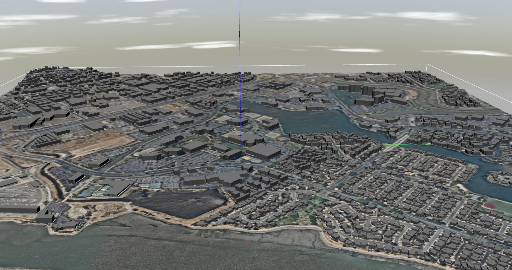

# Gazebo 世界（Worlds）

本主题提供 PX4 支持的 [Gazebo](../simulation/gazebo.md) 世界的有关图像/信息。

The [empty.world](#empty_world) is spawned by default, though this may be overridden by a [model specific world](#model_specific_worlds). Developers can also manually specify the world to load: [Gazebo Simulation > Loading a Specific World](../simulation/gazebo.md#set_world).

所支持世界的源代码可在 GitHub 上找到：[PX4/sitl_gazebo/worlds](https://github.com/PX4/sitl_gazebo/tree/master/worlds)。

## Empty (Default)

[PX4/sitl_gazebo/worlds/empty.world](https://github.com/PX4/sitl_gazebo/blob/master/worlds/empty.world)

## 海湾

[PX4/sitl_gazebo/worlds/baylands.world](https://github.com/PX4/sitl_gazebo/blob/master/worlds/baylands.world)

## KSQL 机场

[PX4/sitl_gazebo/worlds/ksql_airport.world](https://github.com/PX4/sitl_gazebo/blob/master/worlds/ksql_airport.world)

## 麦克米兰机场

[PX4/sitl_gazebo/worlds/mcmillan_airfield.world](https://github.com/PX4/sitl_gazebo/blob/master/worlds/mcmillan_airfield.world)

## 索诺玛赛道

[PX4/sitl_gazebo/worlds/sonoma_raceway.world](https://github.com/PX4/sitl_gazebo/blob/master/worlds/sonoma_raceway.world) 

## 仓库

[PX4/sitl_gazebo/worlds/warehouse.world](https://github.com/PX4/sitl_gazebo/blob/master/worlds/warehouse.world)

## 约塞米蒂

[PX4/sitl_gazebo/worlds/yosemite.world](https://github.com/PX4/sitl_gazebo/blob/master/worlds/yosemite.world)

## Model Specific Worlds

Some [vehicle models](../simulation/gazebo_vehicles.md) rely on the physics / plugins of a specific world. The PX4 toolchain will automatically spawn a world that has the same name as the vehicle model if one exists (instead of the default **empty.world**):

The model specific worlds are:
- [boat.world](https://github.com/PX4/sitl_gazebo/blob/master/worlds/boat.world): Includes a surface to simulate buoyancy of the [boat](../simulation/gazebo_vehicles.md#usv).
- [uuv_hippocampus.world](https://github.com/PX4/sitl_gazebo/blob/master/worlds/uuv_hippocampus.world): An empty world used to simulate an underwater environment for the [HippoCampus UUV](../simulation/gazebo_vehicles.md#uuv).
- [typhoon_h480.world](https://github.com/PX4/sitl_gazebo/blob/master/worlds/typhoon_h480.world): Used by [Typhoon H480 (Hexrotor)](../simulation/gazebo_vehicles.md#typhoon_h480) vehicle model and includes a video widget to enable / disable video streaming. The world includes a gazebo plugin for a simulated camera.
- [iris_irlock.world](https://github.com/PX4/sitl_gazebo/blob/master/worlds/iris_irlock.world): Includes a IR beacon for testing [precision landing](../advanced_features/precland.md).
