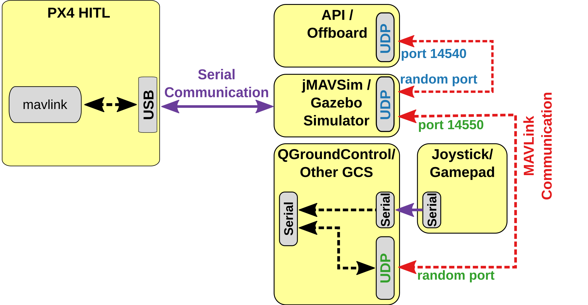
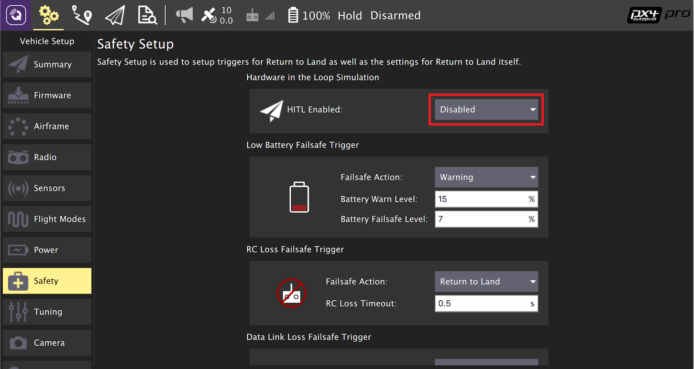
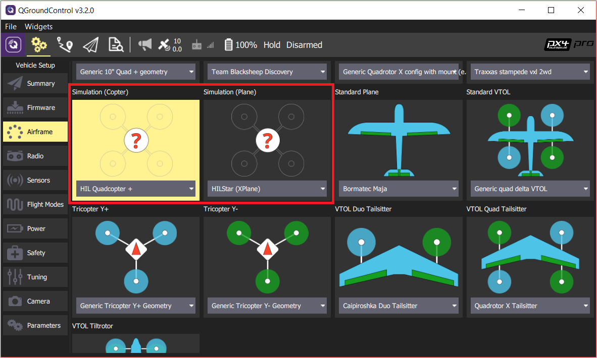
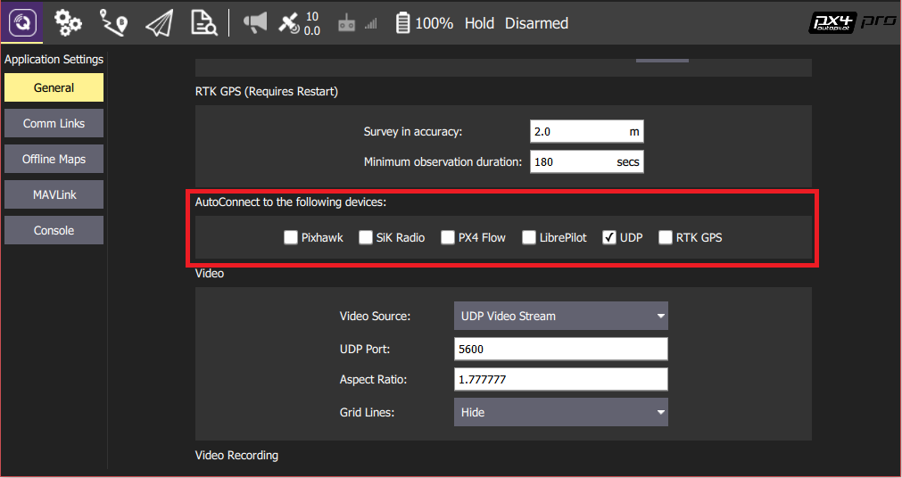

# 硬件在环仿真（HITL）

硬件在环仿真模式 (HITL 或 HIL) 下 PX4 固件代码运行在真实的飞行控制器硬件平台上。 这种方法的优点是可以在实际硬件上测试大多数的实际飞行代码。

HITL 模式下 PX4 支持多旋翼 (使用 jMAVSim 或者 Gazebo) 和固定翼 (使用 Gazebo 或者 X-Plane demo/full version) 无人机的仿真。

<a id="compatible_airframe"></a>

## HITL兼容机架

目前兼容的机架构型和模拟器的情况如下：

| 机架                                                                                                               | `SYS_AUTOSTART` | Gazebo | jMAVSim |
| ---------------------------------------------------------------------------------------------------------------- | --------------- | ------ | ------- |
| [HIL Quadcopter X](../airframes/airframe_reference.md#simulation-plane)                                          | 1001            | Y      |         |
| [HIL Standard VTOL QuadPlane](../airframes/airframe_reference.md#copter_simulation_(copter)_hil_quadcopter_x)    | 1002            | Y      | Y       |
| [HIL Standard VTOL QuadPlane](../airframes/airframe_reference.md#vtol_standard_vtol_hil_standard_vtol_quadplane) | 4001            | Y      |         |
| [Generic Quadrotor x](../airframes/airframe_reference.md#copter_quadrotor_x_generic_quadcopter) copter           | 4011            | Y      | Y       |
| [DJI Flame Wheel f450](../airframes/airframe_reference.md#copter_quadrotor_x_dji_f450_w/_dji_escs)               | 4011            | Y      | Y       |

<a id="simulation_environment"></a>

## HITL 仿真环境

硬件在环仿真（HITL）模式下标准的 PX4 固件在真实的硬件上运行。 JMAVSim 或 Gazebo (运行在开发计算机上) 通过 USB/UART 完成与飞行控制器硬件平台的连接。 模拟器充当在 PX4 和 *QGroundControl* 之间共享 MAVLink 数据的网关。

:::note
The simulator can also be connected via UDP if the flight controller has networking support and uses a stable, low-latency connection (e.g. a wired Ethernet connection - WiFi is usually not sufficiently reliable). For example, this configuration has been tested with PX4 running on a Raspberry Pi connected via Ethernet to the computer (a startup configuration that includes the command for running jMAVSim can be found [here](https://github.com/PX4/PX4-Autopilot/blob/master/posix-configs/rpi/px4_hil.config)).
:::

The diagram below shows the simulation environment:
* 飞控板 HITL 模式被激活 (通过 *QGroundControl*) ，该模式下不会启动飞控板上任何传感器。
* *jMAVSim* 或者 *Gazebo* 通过 USB 连接到飞控板。
* 模拟器通过 UDP 连接到 *QGroundControl* 并将 MAVLink 数据传输至 PX4 。
* (可选) 通过串口可将操纵杆/游戏手柄通过 *QGroundControl* 连接至仿真回路中。
* (可选 - 仅适用于Gazebo) Gazebo 还可以连接到一个 offboard API ，并将 MAVLink 数据桥接到 PX4 。




## HITL 相比于 SITL

相比之下， HITL 在正常飞控硬件平台上运行正常的处于 ”HITL 模式“ 的 PX4 固件。 仿真数据进入整个仿真系统的时间点与 SITL 有所不同。

By contrast, HITL runs normal PX4 firmware in "HITL mode", on normal hardware. The simulation data enters the system at a different point than for SITL. Core modules like commander and sensors have HITL modes at startup that bypass some of the normal functionality.

完成所有的配置设定后 **关闭** *QGroundControl* 并断开飞控板与计算机的连接。


## 配置 HITL

### JMAVSim/Gazebo HITL 仿真环境

1. 通过 USB 将自动驾驶仪直接连接到 *QGroundControl*。
1. 激活 HITL 模式
   1. 打开 **Setup > Safety** 选项卡。
   1. 在 *HITL Enabled* 下拉框中选择 **Enabled** 完成 HITL 模式的激活。

      
1. 选择机架
   1. 打开 **Setup > Airframes** 选项卡。
   1. 选择一个你想要进行测试的 [兼容的机架](#compatible_airframe) 。 Then click **Apply and Restart** on top-right of the *Airframe Setup* page.

      
1. 如有必要, 校准您的 RC 遥控器 或操纵杆。
1. 设置 UDP
   1. 在设置菜单的 "*General*" 选项卡下, 取消选中 *AutoConnect* 一栏中除 **UDP** 外的所有复选框。

      
1. (可选) 配置操纵杆和故障保护。 设置以下 [parameters](https://docs.px4.io/en/advanced_config/parameters.html#finding-a-parameter) 以便使用操纵杆而不是 RC 遥控器：
   * [COM_RC_IN_MODE](../advanced/parameter_reference.md#COM_RC_IN_MODE) 更改为 "Joystick/No RC Checks". 这允许操纵杆输入并禁用 RC 输入检查。 这允许操纵杆输入并禁用 RC 输入检查。
   * [NAV_DLL_ACT](../advanced/parameter_reference.md#NAV_DLL_ACT) 更改为 "Disabled"。 这可确保在没有无线遥控的情况下运行 HITL 时 RC 失控保护不会介入。

:::tip
The *QGroundControl User Guide* also has instructions on [Joystick](https://docs.qgroundcontrol.com/en/SetupView/Joystick.html) and [Virtual Joystick](https://docs.qgroundcontrol.com/en/SettingsView/VirtualJoystick.html) setup.
:::

遵循以下流程进行 X-Plane 模拟器的配置：

### X-Plane HITL 仿真环境

总而言之， HITL 在真实硬件上运行标准 PX4 固件，而 SITL 实际上要比标准 PX4 系统执行更多的代码。

#### Gazebo

:::note
Make sure *QGroundControl* is not running!
:::

1. 更新环境变量：
   ```sh
   cd <Firmware_clone>
    make px4_sitl_default gazebo
   ```
1. 打开载具模型的 sdf 文件（例如 **Tools/sitl_gazebo/models/iris/iris.sdf**）。
1. 找到文件的 `mavlink_interface plugin` 分区，将 `serialEnabled` 和 `hil_mode` 参数更改为 `true` 。

:::note
The serial device depends on what port is used to connect the vehicle to the computer (this is usually `/dev/ttyACM0`). An easy way to check on Ubuntu is to plug in the autopilot, open up a terminal, and type `dmesg | grep "tty"`. The correct device will be the last one shown.
:::

1. Set up the environment variables:
   ```sh
   source Tools/setup_gazebo.bash $(pwd) $(pwd)/build/px4_sitl_default
   ```
   and run Gazebo in HITL mode:
   ```sh
   gazebo Tools/sitl_gazebo/worlds/hitl_iris.world
   ```
1. Start *QGroundControl*. It should autoconnect to PX4 and Gazebo.

<a id="jmavsim_hitl_configuration"></a>

#### jMAVSim (仅适用于四旋翼无人机)

:::note
Make sure *QGroundControl* is not running!
:::

1. 将飞行控制器连接到计算机, 并等待其启动。
1. 在 HITL 模式下运行 jMAVSim (r如有必要，修改串口号名称 `/dev/ttyACM0` - 比如，在 Mac OS 上该参数应为 `/dev/tty.usbmodem1`)： sh ./Tools/jmavsim_run.sh -q -d /dev/ttyACM0 -b 921600 -r 250
   ```sh
   ./Tools/jmavsim_run.sh -q -s -d /dev/ttyACM0 -b 921600 -r 250
   ```

:::note
Replace the serial port name `/dev/ttyACM0` as appropriate. On macOS this port would be `/dev/tty.usbmodem1`. On Windows (including Cygwin) it would be the COM1 or another port - check the connection in the Windows Device Manager.
:::
1. 开启 *QGroundControl*。 它应该会自动连接 PX4 和 Gazebo 。


## 在 HITL 仿真中执行自主飞行任务

You should be able to use *QGroundControl* to [run missions](https://docs.qgroundcontrol.com/master/en/FlyView/FlyView.html#missions) and otherwise control the vehicle.
