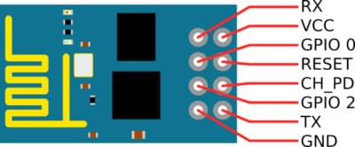

# ESP8266 WiFi 模块

ESP8266 是一款低成本且易于使用的 Wi-Fi 模块，具有完整的 TCP/IP 协议栈和微控制器功能。 It can be used with any Pixhawk series controller.

> **Tip** ESP8266是 *事实上的* 默认WiFi模块，用于 [Pixracer](../flight_controller/pixracer.md) (通常与其捆绑在一起)。

## 购买地点

该模块是现成的。 下面列出了一些供应商。

- [Sparkfun](https://www.sparkfun.com/products/13678)
- [GearBeast](https://us.gearbest.com/boards-shields/pp_009604906563.html)

## 模块设置

ESP8266固件具有以下 *工厂* 设置：

- SSID: PixRacer
- Password: pixracer
- WiFi Channel: 11
- UART speed 921600

### 从源文件编译

[固件仓库](https://github.com/dogmaphobic/mavesp8266) 包含编译和下载固件所需的所有指令和工具。

### 预编译二进制文件

[MavLink ESP8266 Firmware V 1.2.2](http://www.grubba.com/mavesp8266/firmware-1.2.2.bin)

### 更新固件

如果您安装了 1.0.4 或更高版本的固件，则可以通过使用 ESP 的 *Over The Air Update* 特性进行更新。 Just connect to its AP WiFi link and browse to: `http://192.168.4.1/update`. 然后，您可以选择上面下载的固件文件，并将其上传到 WiFi 模块。

### Flashing the ESP8266 Firmware

在下载之前，请确保在 *Flash Mode* 中启动 ESP8266，如下所述。 如果您克隆了 [MavESP8266](https://github.com/dogmaphobic/mavesp8266)存储库，您可以使用提供的 [PlatformIO](http://platformio.org) 工具和环境编译和下载固件。 如果下载了上面预先编译的固件，请下载 [esptool](https://github.com/espressif/esptool) 实用程序，并使用下面的命令行：

    esptool.py --baud 921600 --port /dev/your_serial_port write_flash 0x00000 firmware_xxxxx.bin
    

其中：

- **firmware_xxxxx.bin** 是您上面下载的固件
- **your_serial_port** 是ESP 8266连接到的串行端口的名称 (例如 `/dev/cu.usbmodem`) 。

### 下载固件接线

> **Warning** ESP8266 必须仅以 3.3 伏特供电。

将 ESP8266 设置为 *Flash Mode* 有多种方法，但并非所有 USB/UART 适配器都为自动模式切换提供了所有必要的引脚。 为了以 *Flash Mode* 启动 ESP8266，必须将 GPIO-0 引脚设置为低(GND)，必须将 CH_PD 引脚设置为高(VCC)。 这就是我自己的设置：

我制作了一条电缆，其中 RX、TX、VCC 和 GND 可以从 FTDI 适配器直接连接到 ESP8266。 我为 ESP8266 留下了两条空闲线，并连接到 GPIO-0 和 CH_PD ，这样我可以通过把它们分别连接到 GND 和 VCC 而在正常或在 Flash Mode 下启动 ESP8266。

### ESP8266 (ESP-01) 引脚图

### Flashing Diagram using an FTDI USB/UART Adapter

## Pixhawk/PX4 Setup & Configuration {#px4_config}

> **Tip** If using PX4 1.8.2 (and earlier) you should connect the ESP8266 to TELEM2 and configure the port by [setting the parameter](../advanced_config/parameters.md) `SYS_COMPANION` to 1921600 (remember to reboot after setting the parameter). The following instructions assume you are using PX4 versions after 1.8.2

Connect your ESP8266 to your Pixhawk-series flight controller (e.g. Pixracer) on any free UART.

Connect the flight controller to your ground station via USB (as WiFi is not yet fully set up).

Using *QGroundControl*:

- [Load recent PX4 firwmare](../config/firmware.md)
- [Configure the serial port](../peripherals/serial_configuration.md) used to connect the ESP8266. Remember to set the baud rate to 921600 in order to match the value set for the ESP8266.

Once the firmware (port) is set up you can remove the physical USB connection between the ground station and the vehicle.

## Connect via ESP8266 to QGC

On your wifi-enabled *QGroundControl* ground station computer/tablet, find and connect to the open wireless network for your ESP8266.

- By default the ESP8266 network is named **PixRacer** and the default password is **pixracer**.
- On Windows, the connection settings will look like this:
    
    
    
    

QGC automatically starts its UDP link on boot. Once your computer/tablet is connected to the **PixRacer** WiFi Access Point, it will automatically make the connection.

You should now see HUD movement on your QGC computer via wireless link and be able to view the summary panel for the ESP8266 WiFi Bridge (as shown below).

> **Tip** If you have any problem connecting, see [QGC Installation/Configuration Problems](https://docs.qgroundcontrol.com/en/Support/troubleshooting_qgc.html#waiting_for_connection).