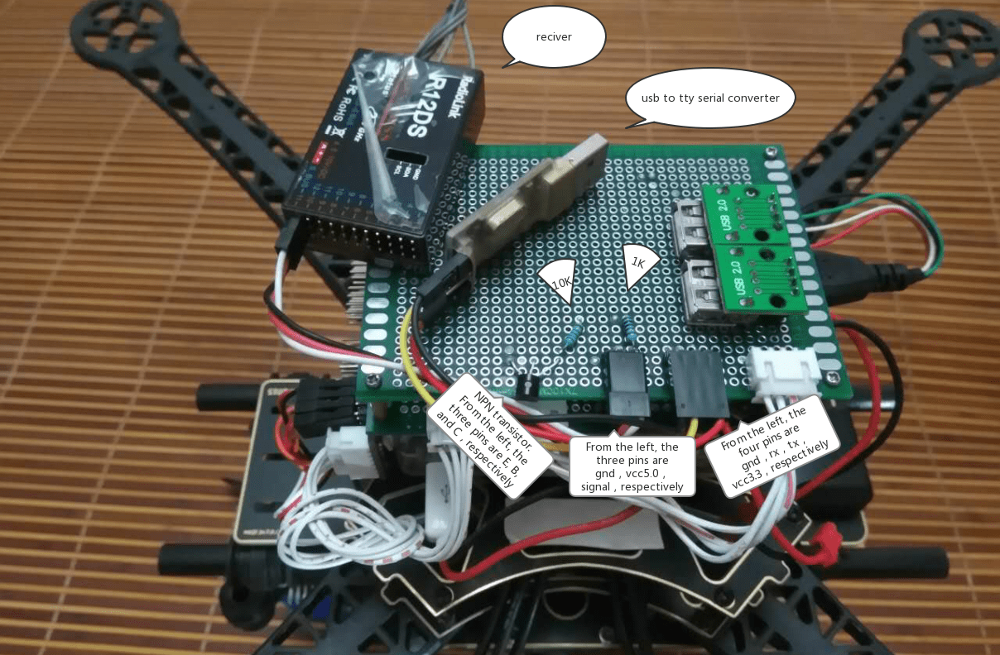

# 将RC接收器连接到基于PX4 Linux的自动驾驶仪

本主题介绍如何设置PX4基于Linux的自动驾驶仪在任何串行端口上连接和使用[支持的RC接收器](../getting_started/rc_transmitter_receiver.md)。

对于S.Bus以外的类型，您可以将接收器直接连接到串口，或者使用USB转TTY串行线（例如 PL2302 USB转串行TTL转换器）。

::: info For an S.Bus receiver (or encoder - e.g. from Futaba, RadioLink, etc.) you will usually need to connect the receiver and device via a [signal inverter circuit](#signal_inverter_circuit), but otherwise the setup is the same.
:::

然后[启动PX4 RC Driver](#start_driver)在设备上，如下图。

<a id="start_driver"></a>

## Signal inverter circuit

要在 UART 上启动 RC驱动程序(例如: `/dev/ttyS2`)：

```sh
linux_sbus start|stop|status -d <device> -c <channel>
```

S.Bus 是 *inverted* UART 通信信号。

<a id="signal_inverter_circuit"></a>

## 源代码

S.Bus 是 _inverted_ UART 通信信号。

The command syntax is:

:::tip
This circuit is also required to read S.Bus remote control signals through the serial port or USB-to-TTY serial converter.
:::

This section shows how to create an appropriate circuit.

### Required components

- 1x NPN 晶体管（例如 NPN S9014 TO92）
- 1x 10K 电阻
- 1x 1K 电阻

::: info
Any type/model of transistor can be used because the current drain is very low.
:::

### Circuit diagram/Connections

Connect the components as described below (and shown in the circuit diagram):

- S.Bus 信号&rarr;1K 电阻&rarr;NPN 晶体管
- NPN晶体管发射&rarr;GND
- 3.3VCC＆&rarr; 10K电阻&rarr; NPN晶体管集合&rarr; USB-to-TTY rxd
- 5.0VCC&rarr;S.Bus VCC
- GND &rarr; S.Bus GND


The image below shows the connections on a breadboard.


