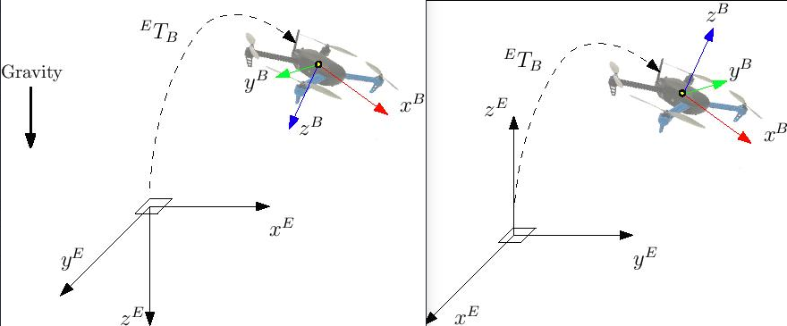

# 使用 Motion Capture 飞行（VICON，Optitrack）

:::warning
**WORK IN PROGRESS**.

Pose (position and orientation) data from the motion capture system is sent to the autopilot over MAVLink, using the [ATT_POS_MOCAP](https://mavlink.io/en/messages/common.html#ATT_POS_MOCAP) message. See the section below on coordinate frames for data representation conventions. The [mavros](../ros/mavros_installation.md) ROS-Mavlink interface has a default plugin to send this message. 这些消息也可以直接使用MAVLINK库并编写C/C++代码来发送和接收。 请参阅下面有关数据表示约定的坐标框架的部分。

It is **highly recommended** that you send motion capture data via an **onboard** computer (e.g Raspberry Pi, ODroid, etc.) for reliable communications. The onboard computer can be connected to the motion capture computer through WiFi, which offers reliable, high-bandwidth connection. 机载计算机可以通过WiFi连接到动作捕捉计算机，提供可靠的高带宽连接。 Heading (yaw) from the motion capture system can also be optionally integrated by the attitude estimator.

Pose (position and orientation) data from the motion capture system is sent to the autopilot over MAVLink, using the [ATT_POS_MOCAP](https://mavlink.io/en/messages/common.html#ATT_POS_MOCAP) message. See the section below on coordinate frames for data representation conventions. The [mavros](../ros/mavros_installation.md) ROS-Mavlink interface has a default plugin to send this message. They can also be sent using pure C/C++ code and direct use of the MAVLink library.

## 计算架构

本节演示如何使用适当的参考坐标系。 关于坐标系有各种各样的表示, 但我们将使用其中两个: ENU 和 NED。

Most standard telemetry links like 3DR/SiK radios are **not** suitable for high-bandwidth motion capture applications.

## 坐标系

This section shows how to setup the system with the proper reference frames. There are various representations but we will use two of them: ENU and NED.

* ENU is a ground-fixed frame where **X** axis points East, **Y** points North and **Z** up. The robot/vehicle body frame is **X** towards the front, **Z** up and **Y** towards the left. 机器人/车身框架朝向前方 **X**，向左朝向 **Z** 和 **Y**。
* NED has **X** towards North, **Y** East and **Z** down. The robot/vehicle body frame has **X** towards the front, **Z** down and **Y** accordingly. 机器人/车身框架具有朝向前方的 **X**，相应地具有 **Z** 和 **Y**。

The ROS topic for motion cap `mocap_pose_estimate` for mocap systems and `vision_pose_estimate` for vision. 有关详细信息, 请检查 [ mavros_extras ](http://wiki.ros.org/mavros_extras)。 有关详细信息, 请检查 [ mavros_extras ](http://wiki.ros.org/mavros_extras)。 

With the external heading estimation, however, magnetic North is ignored and faked with a vector corresponding to world *x* axis (which can be placed freely at mocap calibration); yaw angle will be given respect to local *x*.

:::warning
When creating the rigid body in the motion capture software, remember to first align the robot with the world **X** axis otherwise yaw estimation will have an initial offset.
:::

## Estimator 选择

### LPE 和态度估计 Q

### EKF2

The ROS topic for motion cap `mocap_pose_estimate` for mocap systems and `vision_pose_estimate` for vision. Check [mavros_extras](http://wiki.ros.org/mavros_extras) for further info.

## 测试

## 故障处理
