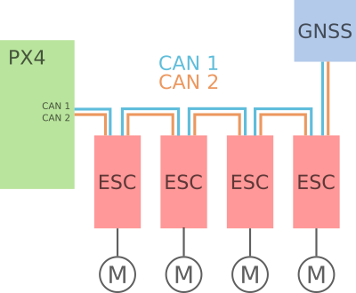

# UAVCAN 介绍

 [UAVCAN](http://uavcan.org) is an onboard network which allows the autopilot to connect to avionics/peripherals. It uses rugged, differential signalling, and supports firmware upgrades over the bus and status feedback from peripherals.

[UAVCAN](http://uavcan.org)是一个板载网络, 它允许自动驾驶仪连接到航空电子设备。 它支持如下硬件:
:::

## 初始设置

It supports hardware like:

- [ESC/Motor controllers](../uavcan/escs.md)
- Airspeed sensors
  - [Thiemar空速传感器](https://github.com/thiemar/airspeed)
- 用于GPS和GLONASS的GNSS接收器
  - [Zubax GNSS](https://www.cubepilot.org/#/here/here3)
  - [Zubax GNSS](https://zubax.com/products/gnss_2)
- Power monitors
  - [Pomegranate Systems Power Module](../uavcan/pomegranate_systems_pm.md)
  - [CUAV CAN PMU Power Module](../uavcan/cuav_can_pmu.md)
- Distance sensors
  - [Ark Flow](ark_flow.md)
  - [Avionics Anonymous Laser Altimeter UAVCAN Interface](../uavcan/avanon_laser_interface.md)
- Optical Flow
  - [Ark Flow](ark_flow.md)

以下说明提供了一个分步指南, 用于连接和设置通过uavcan连接的电调和GPS的四轮车。 选择的硬件是Pixhawk 2.1、Zubax orrel 20电调和Zubax GNSS GPS模块。

## 升级节点固件

第一步是将所有启用uavcan的设备与飞行控制器连接。 下图显示了如何连接所有组件。

The following diagram shows this for a flight controller connected to [UAVCAN motor controllers (ESCs)](../uavcan/escs.md) and a UAVCAN GNSS.

接下来, 按照 [UAVCAN配置](../uavcan/node_enumeration.md)中的说明激活固件中的uavcan功能。 断电重连。

For more information about proper bus connections see [UAVCAN Device Interconnection](https://kb.zubax.com/display/MAINKB/UAVCAN+device+interconnection) (Zubax KB).

:::note
- While the connections are the same, the _connectors_ may differ across devices.
- An second/redundant" CAN interface may be used, as shown above (CAN2). This is optional, but can increase the robustness of the connection.
:::

## 枚举和配置电机控制器

In order to use UAVCAN components with PX4 you will first need to enable the UAVCAN driver:

1. Power the vehicle using the battery (you must power the whole vehicle, not just the flight controller) and connect *QGroundControl*.
1. Navigate to the **Vehicle Setup > Parameters** screen.
1. [UAVCAN_ENABLE](../advanced_config/parameter_reference.md#UAVCAN_ENABLE) must be [set](../advanced_config/parameters.md) to one of the non-zero values.

   The values are:
   - `0`: UAVCAN driver disabled.
   - `1`: Sensors Manual Config.
   - `2`: Sensors Automatic Config.
   - `3`: Sensors and Actuators (ESCs) Automatic Config

   Use `1` if _none_ of the connected UAVCAN devices support automatic configuration (check the manual!), `2` or `3` if _some_ of them support automatic configuration, and `3` if you're using UAVCAN ESCs (this assigns motor controls to the UAVCAN bus rather than PWM).

:::note
You will need to manually allocate static ids for any nodes that don't support automatic configuration. When using dynamic configuration, any manually allocated ids should be given a value greater than the number of UAVCAN devices (to avoid clashes).
:::

Most UAVCAN sensors require no further setup (they are plug'n'play, unless specifically noted in their documentation).

[UAVCAN motor controllers (ESCs)](../uavcan/escs.md) additionally require the motor order be set, and may require a few other parameters be set. Whether this can be done using the simple QGroundControl setup UI depends on the type of ESC (see link for information).

## 相关链接

### 布线

PX4 requires an SD card for UAVCAN node allocation and during firmware update (which happen during boot). Check that there is a (working) SD card present and reboot.

### 固件设置

If the PX4 Firmware arms but the motors do not start to rotate, check that parameter `UAVCAN_ENABLE=3` to use UAVCAN ESCs. If the motors do not start spinning before thrust is increased, check `UAVCAN_ESC_IDLT=1`.

## Developer Information

- [UAVCAN Development](../uavcan/developer.md): Topics related to development and integration of new UAVCAN hardware into PX4.
