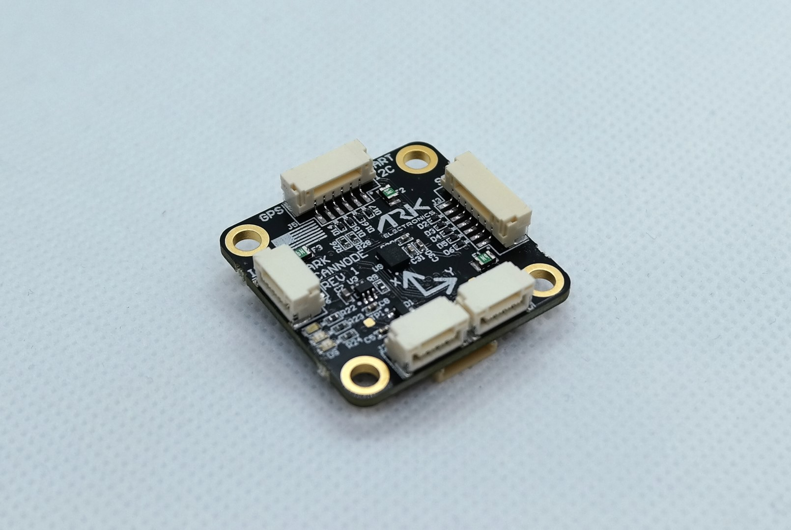

# ARK CANnode

[ARK CANnode](https://arkelectron.com/product/ark-cannode/) is an open source generic [UAVCAN](../uavcan/README.md) node that includes a 6 degree of freedom IMU. Its main purpose is to enable the use of non-CAN sensors (I2C, SPI, UART) on the CAN bus. It also has PWM outputs to expand a vehicle's control outputs in quantity and physical distance.



## Where to Buy

Order this module from:

* [ARK Electronics](https://arkelectron.com/product/ark-cannode/) (US)

## Specifications

* [Open Source Schematic and BOM](https://github.com/ARK-Electronics/ARK_CANNODE)
* Runs [PX4 Open Source Firmware](https://github.com/PX4/PX4-Autopilot/tree/release/1.13/boards/ark/cannode)
* Supports [UAVCAN](README.md) [Firmware Updating](node_firmware.md)
* Dynamic [UAVCAN](README.md) node enumeration
* Sensors
  * PixArt PAW3902 Optical Flow Sensor
    * Tracks under super low light condition of >9 lux
    * Wide working range from 80mm up to 30m
    * Up to 7.4 rad/s
  * 40mW IR LED built onto board for improved low light operation
  * Broadcom AFBR-S50LV85D Time-of-Flight Distance Sensor
    * Integrated 850 nm laser light source
    * Field-of-View (FoV) of 12.4° x 6.2° with 32 pixels
    * Typical distance range up to 30m
    * Operation of up to 200k Lux ambient light
    * Works well on all surface conditions
    * Transmitter beam of 2° x 2° to illuminate between 1 and 3 pixels
  * Bosch BMI088 6-Axis IMU or Invensense ICM-42688-P 6-Axis IMU
* STM32F412CGU6 MCU
  * 1MB Flash
* Two Pixhawk Standard CAN Connectors
  * 4 Pin JST GH
* Pixhawk Standard I2C Connector
  * 4 Pin JST GH
* Pixhawk Standard UART/I2C Connector (Basic GPS Port)
  * 6 Pin JST GH
* Pixhawk Standard SPI Connector
  * 7 Pin JST GH
* PWM Connector
  * 10 Pin JST JST
  * 8 PWM Outputs
  * Matches Pixhawk 4 PWM Connector Pinout
* Pixhawk Standard Debug Connector
  * 6 Pin JST SH
* Small Form Factor
  * 3cm x 3cm x 1.3cm
* LED Indicators
* USA Built
* Power Requirements
  * 5V
  * Current dependent on connected peripherals


### Wiring/Connecting

The ARK CANnode is connected to the CAN bus using a Pixhawk standard 4 pin JST GH cable. Multiple CAN nodes can be connected by plugging additional nodes into the ARK CANnode's second CAN connector.

General instructions for UAVCAN wiring can also be found in [UAVCAN > Wiring](../uavcan/README.md#wiring).

For connecting sensors to the ARK CANnode, refer to the individual sensor's documentation on connecting to a Pixhawk Flight Controller.

## PX4 Setup

### Enabling UAVCAN

In order to use the ARK CANnode board, connect it to the Pixhawk CAN bus and enable the UAVCAN driver by setting parameter [UAVCAN_ENABLE](../advanced_config/parameter_reference.md#UAVCAN_ENABLE) to `2` for dynamic node allocation (or `3` if using [UAVCAN ESCs](../uavcan/escs.md)) (UAVCAN configuration is explained in more detail in [UAVCAN > PX4 Configuration](../uavcan/README.md#px4-configuration).

The steps are:
- In *QGroundControl* set the parameter [UAVCAN_ENABLE](../advanced_config/parameter_reference.md#UAVCAN_ENABLE) to `2` or `3` and reboot (see [Finding/Updating Parameters](../advanced_config/parameters.md)).
- Connect ARK CANnode CAN to the Pixhawk CAN.

Once enabled, the module will be detected on boot.


### PX4 Configuration

Depending on the sensors that are connected to the ARK CANnode, you will need to enable each subscriber on the flight controller under the parameters `UAVCAN_SUB_*` (such as [UAVCAN_SUB_ASPD](../advanced_config/parameter_reference.md#UAVCAN_SUB_ASPD), [UAVCAN_SUB_BARO](../advanced_config/parameter_reference.md#UAVCAN_SUB_BARO) etc.).

On the ARK CANnode, you may need to configure the following parameters:

| Parameter                                                                                       | Description                   |
| ----------------------------------------------------------------------------------------------- | ----------------------------- |
| <a id="CANNODE_TERM"></a>[CANNODE_TERM](../advanced_config/parameter_reference.md#CANNODE_TERM) | CAN built-in bus termination. |


## LED Meanings

You will see both red and blue LEDs on the ARK CANnode when it is being flashed, and a solid blue LED if it is running properly.

If you see a solid red LED there is an error and you should check the following:
- Make sure the flight controller has an SD card installed.
- Make sure the ARK CANnode has `ark_cannode_canbootloader` installed prior to flashing `ark_cannode_default`.
- Remove binaries from the root and ufw directories of the SD card and try to build and flash again.


## Building ARK CANnode Firmware

ARK CANnode is sold with a recent firmware build. Developers who want to update to the very latest version can build and install it themselves using the normal PX4 toolchain and sources.

The steps are:
1. Install the [PX4 toolchain](../dev_setup/dev_env.md).
1. Clone the PX4-Autopilot sources, including ARK CANnode, using *git*:
   ```
   git clone https://github.com/PX4/PX4-Autopilot --recursive
   cd PX4-Autopilot
   ```
1. Build the ARK CANnode firmware:
   ```
   make ark_cannode_default
   ```
1. That will have created a binary in **build/ark_cannode_default** named **XX-X.X.XXXXXXXX.uavcan.bin**. Put this binary on the root directory of the flight controller’s SD card to flash the ARK CANnode. Next time you power your flight controller with the SD card installed, ARK CANnode will automatically be flashed and you should notice the binary is no longer in the root directory and there is now a file named **83.bin** in the ufw directory of the SD card.

   :::note
The ARK CANnode will not boot if there is no SD card in the flight controller when powered on.
:::


## Updating ARK CANnode Bootloader

The ARK CANnode comes with the bootloader pre-installed. You can, however, rebuild and reflash it within the PX4-Autopilot environment.

The steps are:
1. Build the ARK CANnode bootloader firmware:
   ```
   make ark_cannode_canbootloader
   ```
:::note
This will setup your `launch.json` file if you are in VS code. If using the Black Magic Probe and VS code, make sure to update `BMPGDBSerialPort` within this file to the correct port that your debugger is connected to. On MacOS, the port name should look something like `cu.usbmodemE4CCA0E11`.
:::
1. Connect to your ARK CANnode to any Serial Wire Debugging (SWD) device that supports use of GNU Project Debugger (GDB), such as the Black Magic Probe and then connect power to your ARK CANnode via one of the CAN ports.
1. Flash the ARK CANnode with `ark_cannode_canbootloader`. To do so in _VS Code_, you should see `CMake: [ark_cannode_canbootloader]: Ready` on the bottom bar of _VS Code_, indicating what you are flashing. You then flash the bootloader by selecting `Start Debugging` in the Run and Debug window of _VS Code_ and then selecting **Continue** after the first breakpoint.
1. With the bootloader flashed, you are ready to build and flash the ARK CANnode firmware `ark_cannode_default` as outlined above.
